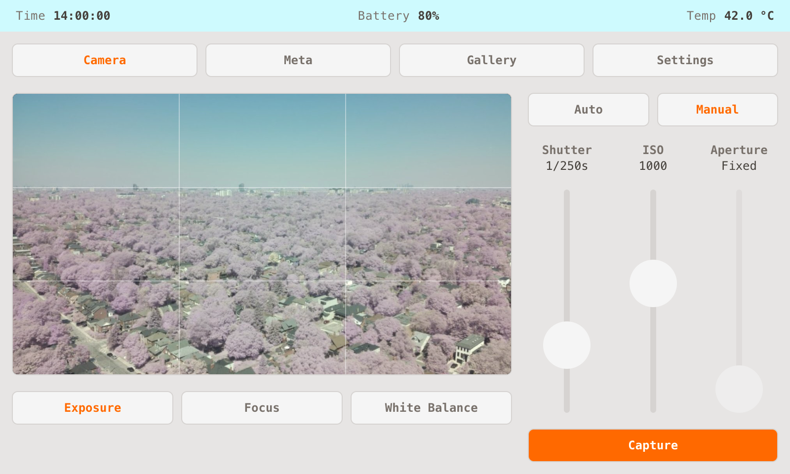

# Pixel Camera — Raspberry Pi camera control app

A touchscreen camera UI for a Raspberry Pi + camera module: a **Next.js**
(static-export) frontend and a **Flask + picamera2** backend. Develop on a Mac
against a mock camera, then deploy to a Pi 5 (Bookworm 64-bit, Wayland/labwc)
where it boots straight into a full-screen kiosk on the app.



Code only ever flows **Mac → Pi**. The Pi is a runtime, not a dev box.

## Features

- **Live viewfinder** — MJPEG preview, tap-to-focus, an optional rule-of-thirds
  grid, and orientation-aware sizing (0/90/180/270° sensor rotation).
- **Focus** — continuous autofocus or manual lens position, with **focus
  peaking** (edge highlighting) in manual mode. Tap anywhere on the preview to
  steer autofocus to that spot.
- **Exposure** — auto, or manual ISO + shutter speed.
- **White balance** — auto, AWB presets, or manual Temperature/Tint. On a NoIR
  sensor a **colour-tuning** toggle swaps in the standard tuning so the presets
  work.
- **Capture** — JPEG, RAW (DNG), or both; adjustable JPEG quality. Trigger from
  the on-screen button or an optional **physical GPIO shutter button**.
- **Gallery** — browse captures (cached thumbnails), full-screen view, delete
  all.
- **Thermal management** — a temperature-triggered throttle (CPU frequency cap
  + reduced preview framerate) plus a tuned fan curve keep the Pi cool under the
  sustained software-JPEG-encode load; toggleable in Settings.
- **Battery/UPS monitoring** — cell voltage → percentage, charging detection,
  and a persisted min/max log (for a Geekworm X120x-class fuel gauge over I2C).
- **Kiosk niceties** — boots straight into the app, auto-reloads after a deploy,
  and a one-shot "exit to desktop" that reboots into the plain desktop once.

## Architecture

```
pixel-camera/
├── backend/
│   ├── app.py               # assembly: blueprint + CORS + static catch-all
│   ├── api.py               # /api routes (JSON + MJPEG preview + SSE events)
│   ├── camera_service.py    # camera singleton, capture orchestration, GPIO button
│   ├── camera.py            # BaseCamera + MockCamera / RealCamera, get_camera()
│   ├── shutter_button.py    # physical shutter button (lgpio)
│   ├── thermal.py           # temperature/throttle monitor, battery/UPS reading
│   ├── events.py            # SSE fan-out (capture start/done -> shutter flash)
│   ├── settings_store.py    # settings.json / battery_log.json persistence
│   └── .venv/               # local dev venv (gitignored)
├── frontend/       # Next.js static export (TS, Tailwind, app router, src dir)
│   └── src/
│       ├── lib/camera-api.ts        # all API calls go through here
│       ├── lib/*-context.tsx        # shared polled state (thermal, focus)
│       ├── lib/use-*.ts             # shared hooks (drag scroll, polling, prefs)
│       ├── components/CaptureView.tsx        # viewfinder + focus peaking
│       ├── components/camera-controls/*.tsx  # exposure / focus / WB panels
│       └── app/page.tsx
├── marketing/
│   ├── assets/              # screenshots and stills for README / site
│   └── video/               # highlight-reel source + compose scripts
├── scripts/deploy.sh        # Mac → Pi deploy
├── _deploy/
│   ├── ircam-api.service.tpl  # systemd unit template (CAMERA=real)
│   ├── kiosk.sh               # Chromium kiosk launcher (boot-to-desktop flag)
│   ├── labwc-autostart.tpl    # labwc autostart: launch kiosk.sh on login
│   └── labwc-rc.xml           # labwc touch-input config
├── requirements.txt         # flask, flask-cors, Pillow  (NOT picamera2)
└── package.json             # `npm run dev` runs both servers
```

- **Camera selection** is by the `CAMERA` env var: `real` → `RealCamera`
  (picamera2), anything else → `MockCamera` (Pillow-synthesized frames).
- `picamera2` is imported lazily inside `RealCamera.__init__` and is **not** in
  `requirements.txt`; on the Pi it comes from apt via a `--system-site-packages`
  venv. This is what lets the backend import cleanly on the Mac.
- Optional physical shutter button: with `CAMERA=real`, a momentary button
  between GPIO17 (BCM, override with `SHUTTER_GPIO_PIN`) and GND triggers the
  same capture path as the UI. Uses `lgpio` directly, not `gpiozero`, whose
  pull-up silently no-ops on the Pi 5.
- In production Flask serves the static export from `frontend/out` (single-origin,
  relative `/api`). In dev the frontend runs on :3000 cross-origin to Flask on
  :5000 (flask-cors handles it).

## Dev setup (Mac)

Prereqs: Node 18+, Python 3.9+.

```bash
# 1. Backend venv + deps
python3 -m venv backend/.venv
backend/.venv/bin/pip install -r requirements.txt

# 2. Frontend + root deps
npm --prefix frontend install
npm install

# 3. Frontend env
cp frontend/.env.example frontend/.env.local   # already points at :5000

# 4. Run both servers (backend :5000 with mock camera, frontend :3000)
npm run dev
```

Open <http://localhost:3000>. You should see the moving mock preview and a
Capture button that saves a frame to `backend/captures/` and reports its
filename.

Quick API check:

```bash
curl -s localhost:5000/api/health           # {"status":"ok"}
curl -s -X POST localhost:5000/api/capture  # {"filename":"capture-...jpg"}
```

## Deploy (Mac → Pi)

One-time, from the Mac:

```bash
cp deploy.env.example deploy.env   # then edit it for your Pi (gitignored)
ssh-copy-id pi@raspberrypi.local   # passwordless SSH for deploys
```

Then deploy anytime:

```bash
./scripts/deploy.sh
```

This builds the static export (relative `/api`), rsyncs `backend/` +
`frontend/out/` to the Pi, installs deps, restarts the API service, and installs
the kiosk autostart (see below). The running kiosk **auto-reloads** within a few
seconds — no manual refresh needed for frontend changes.

Host/user/path come from `deploy.env` (gitignored) or matching env vars,
defaulting to a stock Raspberry Pi OS setup (`pi@raspberrypi.local`, `~/ir-cam/`).

## Pi setup (run on the Pi, once)

> Do these once on a fresh Pi before the first `./scripts/deploy.sh`.

```bash
# 1. System packages (picamera2/lgpio from apt — do NOT pip install them)
sudo apt update
sudo apt install -y python3-picamera2 python3-lgpio chromium rsync

# 2. App dir + venv WITH system site packages (so picamera2 is importable)
mkdir -p ~/ir-cam && cd ~/ir-cam
python3 -m venv --system-site-packages .venv

# (deploy.sh will rsync the code and pip-install flask/flask-cors/Pillow here)
```

### systemd API service

`deploy.sh` installs and enables the service on first run (and restarts it on
every deploy after), relying on the deploy user's passwordless `sudo` (the
Raspberry Pi OS default). Verify after a deploy:

```bash
systemctl status ircam-api.service          # active (running)
curl -s localhost:5000/api/health           # {"status":"ok"}
```

### Kiosk mode (boots into the app)

`deploy.sh` installs a labwc autostart that boots the Pi straight into a
full-screen Chromium kiosk on the app. It syncs `kiosk.sh` to `~/ir-cam/` and
installs `~/.config/labwc/autostart` (rendered from `_deploy/labwc-autostart.tpl`);
the first deploy that changes either prints `REBOOT_REQUIRED` (autostart only
takes effect on the next login). For the kiosk to come up on boot the Pi must
log into the desktop session automatically:

```bash
sudo raspi-config
# System Options → Boot / Auto Login → Desktop Autologin
sudo reboot
```

`kiosk.sh` waits for the API to be healthy, then launches Chromium full-screen,
respawning it if it crashes. The normal desktop session (panel, file manager)
still runs underneath, so there's always something to fall back to.

**Exit to desktop (one-shot).** The Settings tab has an *Exit to desktop*
button: it writes a flag and reboots, and that one boot comes up on the plain
desktop instead of the kiosk. The reboot after that returns to kiosk mode
automatically. (`POST /api/system/exit-kiosk` drives this.)

If you'd rather **not** boot into the kiosk, remove `~/.config/labwc/autostart`
on the Pi (a `.bak` of any prior version is kept next to it) and reboot — the
API service still runs, and you can open `http://<pi-host>:5000` in any browser
on the network.

## Pi cheat-sheet (from the Mac)

Replace `pi@raspberrypi.local` with your Pi's user/host.

**Copy captures to the Mac** (dated folder in Downloads; pulls JPEG + RAW DNG):
```bash
DEST=~/Downloads/pi-captures-$(date +%Y%m%d); mkdir -p "$DEST"
rsync -av pi@raspberrypi.local:~/ir-cam/captures/ "$DEST/"
# only JPEGs: add  --include='*.jpg' --exclude='*'   (or '*.dng' for raw only)
```

**Reload the kiosk** (rarely needed — deploys auto-reload it; this forces a
fresh Chromium):
```bash
ssh pi@raspberrypi.local 'pkill -f -- --kiosk'   # labwc/kiosk.sh respawns it
```

**Power off cleanly:**
```bash
ssh pi@raspberrypi.local 'sudo poweroff'
```

## Troubleshooting

**macOS: `localhost:5000` returns 403 `AirTunes` instead of the backend.**
macOS Control Center runs an **AirPlay Receiver** on port 5000 (incl. IPv6),
and `localhost` resolves to IPv6 `::1` first, shadowing Flask. The backend is
fine — it's just hidden. Two fixes:

- **Recommended:** turn it off — System Settings → General → AirDrop & Handoff →
  **AirPlay Receiver: Off**. Then `localhost:5000` works everywhere (browser +
  curl).
- **Or** use the IPv4 address: `curl 127.0.0.1:5000/api/health`, and set
  `NEXT_PUBLIC_API_BASE=http://127.0.0.1:5000` in `frontend/.env.local`.

This only affects Mac dev. The Pi has no such conflict.

## Notes

- `RealCamera` only runs on the Pi; it is never exercised on the Mac. Its
  hardware-specific settings (focus, white balance, colour tuning, thermal
  throttle, battery gauge) are no-ops or synthesized under `MockCamera`, so the
  whole UI is exercisable in Mac dev without a camera attached.
- The captured images live in `backend/captures/` (dev) and `~/ir-cam/captures/`
  (Pi), both gitignored. Per-device state (`settings.json`, `battery_log.json`)
  is also gitignored and excluded from deploys, so it survives redeploys.
- Thermal throttling and the battery gauge are specific to a Pi 5 + active
  cooler and a Geekworm X120x-class UPS; on other hardware they degrade
  gracefully (throttle by CPU frequency only, or report no battery).

## Security

This app has **no authentication**. On the Pi the API service binds
`0.0.0.0:5000`, so anyone who can reach the Pi on the network can view the live
preview, trigger captures, and read saved images. That's intentional for a
single-device kiosk on a trusted home/lab LAN — but it means **the Pi trusts its
entire network**.

Before exposing it more widely:

- Keep the device on a trusted network; do **not** port-forward `:5000` to the
  public internet.
- Put it behind a reverse proxy with auth/TLS, or bind the API to `127.0.0.1`
  and front it, if you need access beyond the local kiosk.
- The Flask server is run directly via systemd (not behind a WSGI server). This
  is fine for one local device but is not hardened for untrusted traffic.

## License

[MIT](LICENSE) © David Chan
