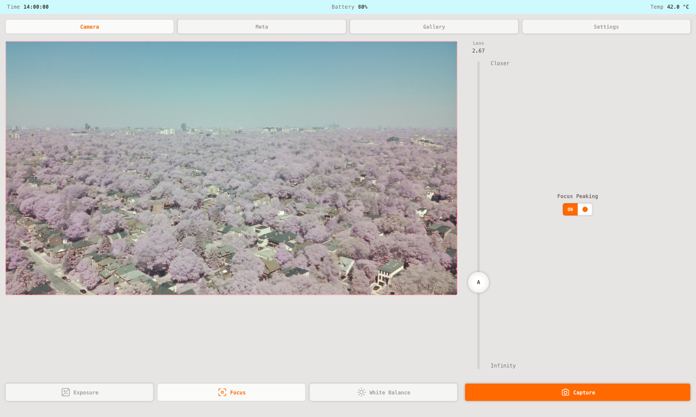

# Pixel Camera

A full-screen touchscreen camera for Raspberry Pi. Live preview, manual controls, RAW+JPEG capture, and a gallery — built to boot straight into a kiosk on a Pi 5 with an **800×480** display.



## What you get

- **Live viewfinder** — tap to focus, composition grids with adjustable opacity, rotate the sensor to match your mount
- **Exposure** — auto, or lock in ISO and shutter yourself
- **Focus** — continuous autofocus or manual lens control, with an on/off focus-peaking overlay
- **White balance** — auto, presets (daylight, cloudy, tungsten…), or manual temperature and tint
- **Grid** — thirds, Fibonacci, harmonic, golden triangle/spiral, vanishing point, and more
- **Capture** — JPEG, RAW (DNG), or both; on-screen shutter or an optional physical GPIO button
- **Gallery** — browse thumbnails, open full-screen, clear everything when you’re done
- **Status at a glance** — time, battery, and temperature in the header
- **Built for the Pi** — boots into the app at 800×480, stays cool under load, and can exit to the desktop when you need it

## Hardware

Designed for:

- Raspberry Pi 5 (Bookworm 64-bit, Wayland / labwc)
- Camera module (including NoIR, with colour-tuning support)
- **800×480** touchscreen display
- Optional: physical shutter button on GPIO, Geekworm X120x-class UPS for battery readout,
  and a rotary focus dial (CLK GPIO23, DT GPIO24, switch GPIO25)

Develop on a Mac with a mock camera — no Pi required until you’re ready to deploy.

## Using the app

| Tab | What it’s for |
| --- | --- |
| **Camera** | Live preview plus Exposure / Focus / White Balance / Grid controls |
| **Meta** | Live sensor readouts and control ranges |
| **Gallery** | Review and delete captures |
| **Settings** | Capture button, rotation, quality, format, thermal throttle, exit kiosk |

On the Camera tab, the control strip under the viewfinder switches the side panel. Tap the preview to focus. Use **Capture** (or the GPIO shutter) to save. Photos land in `captures/` on the device.

## Quick start (Mac)

Prereqs: Node 18+, Python 3.9+.

```bash
python3 -m venv backend/.venv
backend/.venv/bin/pip install -r requirements.txt

npm --prefix frontend install
npm install
cp frontend/.env.example frontend/.env.local

npm run dev
```

Open [http://localhost:4000](http://localhost:4000) (or the port Next prints). You should see a live mock preview and be able to capture frames into `backend/captures/`.

> **macOS tip:** AirPlay Receiver often occupies port 5000. If the API fails, turn AirPlay Receiver off in System Settings, or keep `NEXT_PUBLIC_API_BASE=http://127.0.0.1:5000` in `frontend/.env.local`.

## Deploy to a Pi

**Once on the Pi:**

```bash
sudo apt update
sudo apt install -y python3-picamera2 python3-lgpio chromium rsync

mkdir -p ~/ir-cam && cd ~/ir-cam
python3 -m venv --system-site-packages .venv

sudo raspi-config   # System Options → Boot / Auto Login → Desktop Autologin
```

**From the Mac:**

```bash
cp deploy.env.example deploy.env   # edit for your Pi
ssh-copy-id pi@raspberrypi.local
./scripts/deploy.sh
```

Deploy builds the UI, syncs it to the Pi, restarts the API, and sets up kiosk autostart. The kiosk reloads on its own after a deploy.

**Exit to desktop** (Settings) reboots once into the normal desktop; the next reboot returns to kiosk mode.

### Handy commands (from the Mac)

```bash
# Pull captures
DEST=~/Downloads/pi-captures-$(date +%Y%m%d); mkdir -p "$DEST"
rsync -av pi@raspberrypi.local:~/ir-cam/captures/ "$DEST/"

# Force-reload the kiosk
ssh pi@raspberrypi.local 'pkill -f -- --kiosk'

# Power off
ssh pi@raspberrypi.local 'sudo poweroff'
```

## Security

There is **no login**. On the Pi the API listens on the network, so anyone on your LAN can see the preview and take photos. That’s fine for a trusted home or lab network — don’t expose port 5000 to the internet.

## License

[MIT](LICENSE) © David Chan
